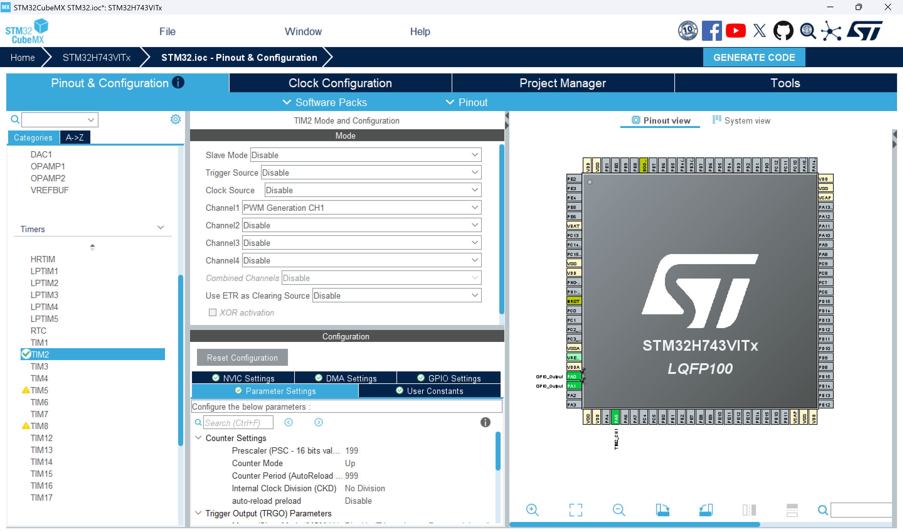
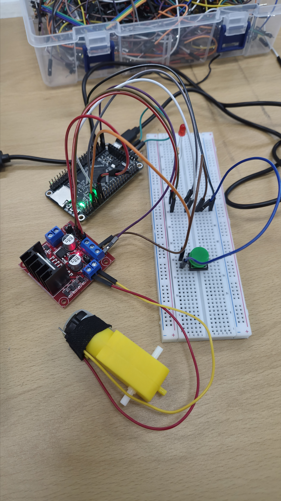
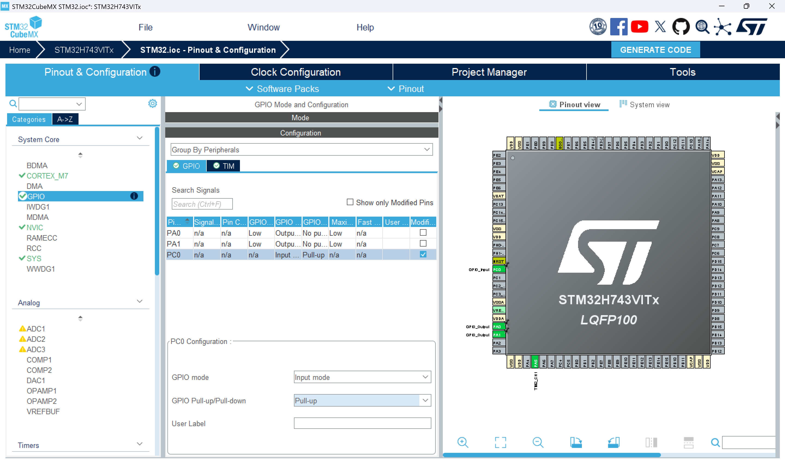

# 기어모터 제어 과제 실험 결과 보고서

## [실험 개요]

본 실험은 **TT 기어모터**, **모터 드라이버 모듈(L298N)**, 그리고 **STM32H743VIT6** 보드를 이용하여 모터의 회전 방향 및 속도를 제어하는 시스템을 설계하는 것을 목표로 한다.

초기에는 지연 함수(`HAL_Delay`)를 활용한 기초적인 자동 반복 동작을 수행하였으며(실험 1), 이후 푸시버튼을 브레드보드에 추가하고 인터럽트와 논블로킹(Non-blocking) 제어 구조를 적용하여 구동 방식(실험 2, 3)을 고도화해 나가는 과정으로 진행되었다.

---

## 1. 하드웨어 기본 배선

기본적인 모터 구동을 위해 STM32와 L298N 모터 드라이버 모듈 간의 전원 및 제어 회로를 연결하였다.

|           L298N 핀           | 연결 위치 (STM32 / 모터) | 역할                                |
| :--------------------------: | :----------------------: | :---------------------------------- |
|      **`12V`**      |       STM32 `5V`       | 모터 구동 전원 공급                 |
|      **`GND`**      |      STM32 `GND`      | 공통 그라운드 (신호 기준 전압 통일) |
|      **`ENA`**      |      STM32 `PA5`      | 모터 속도 제어 (PWM 신호 입력)      |
|      **`IN1`**      |      STM32 `PA0`      | 모터 회전 논리 제어 1               |
|      **`IN2`**      |      STM32 `PA1`      | 모터 회전 논리 제어 2               |
| **`OUT1`, `OUT2`** |       TT 기어모터       | 증폭된 전력을 모터로 출력           |

---

## 2. [실험 1] 버튼 없이 구동되는 순차적 모터 제어

전원이 인가되면 "정방향 3초(빠르게) ➔ 정지(1초) ➔ 역방향 3초(느리게)" 구간을 무한 반복하는 기초 동작 실험이다.

### 2-1. STM32CubeMX 프로그램 설정

코드 생성에 앞서 핀 동작 모드와 타이머를 설정하였다.

* **GPIO 설정:** `PA0`, `PA1` 핀을 `GPIO_Output`으로 설정
* **타이머(TIM2) 설정:**

  * Mode 설정: Channel 1을 `PWM Generation CH1`으로 지정 (이로 인해 `PA5` 핀이 자동 할당됨)
  * Configuration ➔ Parameter Settings 설정:
    * **Prescaler (PSC)**: `199` 로 설정하여 빠른 내부 클럭 속도를 낮춤
    * **Counter Period (ARR)**: `999` 로 설정하여 튜티비(Duty Cycle)를 0~1000 단위로 직관적으로 관리

  <div align="center"></div>
* **코드 생성:** 위와 같이 설정 후 `GENERATE CODE`를 눌러 `.ioc` 파일 저장 및 C 코드 생성.

### 2-2. 소스 코드 구현 및 실행 결과

STM32CubeIDE 프로그램으로 돌아와 `main.c` 파일 내부 루프 안에 다음과 같이 제어 코드를 작성하였다.

```c
    // --- [1] 모터 정방향 회전 ---
    HAL_GPIO_WritePin(GPIOA, GPIO_PIN_0, GPIO_PIN_SET);   // IN1 = HIGH
    HAL_GPIO_WritePin(GPIOA, GPIO_PIN_1, GPIO_PIN_RESET); // IN2 = LOW
    __HAL_TIM_SET_COMPARE(&htim2, TIM_CHANNEL_1, 800);    // 속도 80% 생성
    HAL_Delay(3000); // 3초간 블로킹(대기)하며 회전 유지

    // --- [2] 모터 정지 ---
    HAL_GPIO_WritePin(GPIOA, GPIO_PIN_0, GPIO_PIN_RESET);
    HAL_GPIO_WritePin(GPIOA, GPIO_PIN_1, GPIO_PIN_RESET);
    __HAL_TIM_SET_COMPARE(&htim2, TIM_CHANNEL_1, 0);      // 속도 0%
    HAL_Delay(1000); // 1초간 회전 정지 상태 개소

    // --- [3] 모터 역방향 회전 ---
    HAL_GPIO_WritePin(GPIOA, GPIO_PIN_0, GPIO_PIN_RESET); // IN1 = LOW
    HAL_GPIO_WritePin(GPIOA, GPIO_PIN_1, GPIO_PIN_SET);   // IN2 = HIGH
    __HAL_TIM_SET_COMPARE(&htim2, TIM_CHANNEL_1, 500);    // 속도 50% (느리게)
    HAL_Delay(3000); // 3초간 대기
```

**[결과]**: 코드 빌드 후 STM32CubeProgrammer 등을 이용하여 칩에 펌웨어를 업로드한 결과, 모터가 설계된 딜레이에 맞춰 정상적으로 동작 완료함을 1차 확인하였다.

---
### 2-3. 동작 영상

<div align="center">
  <video src="https://github.com/user-attachments/assets/7bc50667-44b9-4d3f-984c-75aef21ee8cd" controls width="600"></video>
</div>


## 3. [실험 2] 푸시버튼을 이용한 다중 모드 구동

모터 구동 중에 즉시 명령을 받기 위해 브레드보드에 푸시버튼을 장착하였으며, 제어 방식을 타이머 폴링으로 업그레이드하였다.

### 3-1. 하드웨어 변경 및 MX 설정 보강

* **버튼 하드웨어 배선:** 푸시버튼에 있는 "대각선 위치"의 두 다리를 선택하여 한 다리(a)는 STM32의 `PC0`에 연결하고, 다른 다리(b)는 브레드보드의 **`GND`** 구역에 연결하였다.

  <div align="center"></div>
* **STM32CubeMX 설정:** Pinout & Configuration 탭의 `System Core ➔ GPIO` 설정에서 `PC0` 핀을 선택한 뒤, `GPIO Pull-up/Pull-down` 옵션을 `Pull-up`으로 설정하여 평상시 HIGH 상태를 유지하게끔 내부 회로를 구성하였다.

  <div align="center"></div>

### 3-2. 논블로킹 제어 알고리즘 구현

버튼 조작에 따라 4가지 행동 패턴("정방향 연속 / 역방향 연속 / 정방향 반복 / 역방향 반복")을 차례로 전환하고 상태를 기억하기 위해 전역 변수들을 선언하였다.

```c
  /* 전역 변수 설정 (USER CODE BEGIN 1) */
  uint8_t mode = 0;              // 현재 상태 (0: 대기, 1: 정방향연속, 2: 역방향연속, 3: 정방향반복, 4: 역방향반복)
  uint8_t prev_btn = 1;          // 버튼 이전 상태 (Pull-up이므로 기본 1)
  uint32_t last_action_time = 0; // 마지막 상태 변화 시간 저장
  uint8_t timer_state = 0;       // 1: 동작 중, 0: 정지 중
```

```c
    // [1] 버튼 입력 (Debounce 처리)
    uint8_t curr_btn = HAL_GPIO_ReadPin(GPIOC, GPIO_PIN_0);
    if (prev_btn == 1 && curr_btn == 0) { 
        mode++;   // 누를 때마다 동작 상태 변수 증가
        if (mode > 4) mode = 1;
        timer_state = 1; 
        last_action_time = HAL_GetTick(); // Non-blocking 타이머 초기화
        HAL_Delay(50);
    }
    prev_btn = curr_btn; 

    // [2] Non-blocking 방식 모드별 제어
    uint32_t current_time = HAL_GetTick(); // 시스템 시간 지속 호출

    if (mode == 1) { // 정방향 연속
        HAL_GPIO_WritePin(GPIOA, GPIO_PIN_0, GPIO_PIN_SET);
        HAL_GPIO_WritePin(GPIOA, GPIO_PIN_1, GPIO_PIN_RESET);
        __HAL_TIM_SET_COMPARE(&htim2, TIM_CHANNEL_1, 800);
    }
    else if (mode == 2) { // 역방향 연속
        HAL_GPIO_WritePin(GPIOA, GPIO_PIN_0, GPIO_PIN_RESET);
        HAL_GPIO_WritePin(GPIOA, GPIO_PIN_1, GPIO_PIN_SET);
        __HAL_TIM_SET_COMPARE(&htim2, TIM_CHANNEL_1, 500);
    }
    else if (mode == 3) { // [핵심] 정방향 3초 후 1초 대기 (무한반복)
        if (timer_state == 1) { // 도는 중
            HAL_GPIO_WritePin(GPIOA, GPIO_PIN_0, GPIO_PIN_SET);
            HAL_GPIO_WritePin(GPIOA, GPIO_PIN_1, GPIO_PIN_RESET);
            __HAL_TIM_SET_COMPARE(&htim2, TIM_CHANNEL_1, 800);
            if (current_time - last_action_time >= 3000) { // 3초 만료 감지
                timer_state = 0; last_action_time = current_time;
            }
        } else { // 대기 중
            HAL_GPIO_WritePin(GPIOA, GPIO_PIN_0, GPIO_PIN_RESET);
            HAL_GPIO_WritePin(GPIOA, GPIO_PIN_1, GPIO_PIN_RESET);
            __HAL_TIM_SET_COMPARE(&htim2, TIM_CHANNEL_1, 0);
            if (current_time - last_action_time >= 1000) { // 1초 만료 감지
                timer_state = 1; last_action_time = current_time;
            }
        }
    }
```

**[결과]**: 실험 1의 `HAL_Delay`에 의한 코드 정지(Blocking) 현상이 극복되어, 모터가 3초간 도는 중에 사용자가 버튼을 눌러도 코드 반응성이 즉각적으로 보장됨을 확인하였다.


---

## 4. [실험 3] "1회전 정밀 통제" 알고리즘 시스템 구축 (최종 완성)

마지막으로, 사용자가 스위치를 누르면 모터가 **"정확히 원반 1바퀴만큼 회전하고 즉각 정지"** 하는 제어 시스템을 구축하였다.
일반 TT 모터에는 엔코더 센서가 없으므로 정밀한 시간 지연(`HAL_GetTick`)을 회전 시간으로 치환하여 달성하였다.

### 4-1. 전역 변수 및 회전수 근사 논리 구성

회전 간격 및 교차 회전 모드를 기억하기 위해 전역 변수 로직을 다음과 같이 재구성하였다.

```c
  /* 전역 변수 설정 (USER CODE BEGIN 1) */
  uint8_t direction_mode = 0;    // 0: 시작 대기, 1: 우회전 모드, 2: 좌회전 모드
  uint8_t prev_btn = 1;          // 버튼 이전 상태 (Pull-up이므로 기본 1)
  uint8_t is_running = 0;        // 1: 모터 작동 중, 0: 모터 정지 중
  uint32_t start_time = 0;       // 모터 동작 시작 시간
  uint32_t ROTATE_TIME_MS = 650; // 한 바퀴 회전하는 데 걸리는 시간(ms)
```

```c
    // [1] 버튼 입력 및 교차 회전(우회전 ➔ 좌회전) 명령 전환
    uint8_t curr_btn = HAL_GPIO_ReadPin(GPIOC, GPIO_PIN_0);
    if (prev_btn == 1 && curr_btn == 0) { 
        if (is_running == 0) { // 모터가 정지 상태일 때만 새 명령 수용
            direction_mode++;
            if (direction_mode > 2) direction_mode = 1; // 1: 우, 2: 좌 번갈아가며 순환
            
            is_running = 1;              // 모터 구동 상태로 전환
            start_time = HAL_GetTick();  // 회전 시작 시간 타이머 기록
        }
        HAL_Delay(50); // 채터링 방지 (디바운싱)
    }
    prev_btn = curr_btn; 

    // [2] 설정된 시간(ROTATE_TIME_MS)만큼 구동 후 강제 정지하는 논리
    if (is_running == 1) { 
        uint32_t current_time = HAL_GetTick();
  
        // (현재시간 - 시작시간)차이가 구동 제한시간(ROTATE_TIME_MS)보다 작으면 회전
        if ((current_time - start_time) < ROTATE_TIME_MS) {
        
            if (direction_mode == 1) {
                // 오른쪽 1회전 논리 (PWM 속도: 80%) 진행
                HAL_GPIO_WritePin(GPIOA, GPIO_PIN_0, GPIO_PIN_SET);
                HAL_GPIO_WritePin(GPIOA, GPIO_PIN_1, GPIO_PIN_RESET);
                __HAL_TIM_SET_COMPARE(&htim2, TIM_CHANNEL_1, 800); 
            } else if (direction_mode == 2) {
                // 왼쪽 1회전 논리 (PWM 속도: 80%) 진행
                HAL_GPIO_WritePin(GPIOA, GPIO_PIN_0, GPIO_PIN_RESET);
                HAL_GPIO_WritePin(GPIOA, GPIO_PIN_1, GPIO_PIN_SET);
                __HAL_TIM_SET_COMPARE(&htim2, TIM_CHANNEL_1, 800); 
            }
        
        } 
        else {
            // 제한 시간(ROTATE_TIME_MS 예: 600ms)이 만료되면 1바퀴로 간주 후 강제 셧다운
            is_running = 0;
            HAL_GPIO_WritePin(GPIOA, GPIO_PIN_0, GPIO_PIN_RESET);
            HAL_GPIO_WritePin(GPIOA, GPIO_PIN_1, GPIO_PIN_RESET);
            __HAL_TIM_SET_COMPARE(&htim2, TIM_CHANNEL_1, 0);
        }
    } 
```
### 4-2. 동작 영상

<div align="center">
  <video src="https://github.com/user-attachments/assets/ca52bc90-77f9-4d4b-b55a-a50463431532" controls width="600"></video>
</div>


### 4-3. 최종 고찰

* **하드웨어의 한계 극복:** 엔코더 모터가 아님에도 불구하고 소프트웨어 시계 타이머를 정밀 차등 스케줄링하여 시간-회전 비례 구동을 통한 1바퀴 목표 달성에 성공하였다.
* **임베디드 제어 최적화:** 버튼 입력의 채터링을 하드웨어(저항, 캐패시터) 추가 없이 STM32 GPIO Pull-up과 `HAL_Delay(50)`의 소프트웨어 디바운싱만으로 깔끔히 처리해내어 회로 구성을 최적화할 수 있었다.

---

## 5. [실험 4] 다중 버튼 논블로킹 논리 및 5가지 모드 완벽 통합 제어

마지막으로, 5개의 독립된 푸시버튼을 활용하여 기어모터의 다중 동작(무한 회전, 1바퀴 단발 구동, 3초 왕복 루프)과 5개의 상태 표시 LED를 완벽히 연동하는 종합 알고리즘을 구축하였다.

### 5-1. 외부 LED 추가 배선 및 STM32CubeMX 핀 설정

다수의 제어 및 피드백 상태를 직관적으로 통제하기 위해, 5개의 독립된 푸시버튼을 연결하고 해당하는 5개의 상태 표시 LED를 1:1로 배열해 하드웨어를 확장 구성하였다.

**1. 하드웨어 배선 연장**
*   **푸시버튼 (5개):** 스위치의 한쪽 다리는 핀번호에 맞게 STM32 보드에 연결하고, 반대쪽 다리는 브레드보드의 `GND` 구역에 묶어 버튼을 누를 때 입력이 L(Low)로 떨어지도록 구성하였다.
*   **상태 표시 LED (5개):** 다리가 긴 양극(+)은 330Ω 저항을 거쳐 STM32의 지정된 출력 핀에 연결하고, 짧은 음극(-)은 `GND`로 공통 연결하여 안정적으로 발광하도록 하였다.

  <div align="center"></div>
  


**2. STM32CubeMX 핀(Pinout) 매핑 및 속성 요약표**

설계한 5가지 다중 동작을 하드웨어와 완벽하게 1:1로 매칭시키기 위해, 프로젝트 `.ioc` 파일에서 다음과 같이 핀들을 활성화하고 세부 옵션을 설정하였다. 모터 제어 핀은 실험 1부터 이어온 설정을 그대로 유지한다.

| 기구/부품 | 핀 번호 | 설정 모드(Mode) | 상세 설정 (Configuration) | 구현된 매핑 기능 |
| :-- | :---: | :--- | :--- | :--- |
| **모터 정방향** | `PA0` | `GPIO_Output` | Output Push Pull, No pull | 모터 드라이버 IN1 신호 출력 |
| **모터 역방향** | `PA1` | `GPIO_Output` | Output Push Pull, No pull | 모터 드라이버 IN2 신호 출력 |
| **모터 속도 제어**| `PA5` | `TIM2_CH1` | PWM Generation CH1 (`ARR`=999, `PSC`=199) | L298N ENA 포트에 속도 50% PWM 출력 |
| **푸시버튼 1** | `PE12` | `GPIO_Input` | **Pull-up** (내부 풀업 저항 켬) | 3초간 정/역회전 사이클 무한 돌입 |
| **푸시버튼 2** | `PE14` | `GPIO_Input` | **Pull-up** (내부 풀업 저항 켬) | 무한 정회전 진입 |
| **푸시버튼 3** | `PB10` | `GPIO_Input` | **Pull-up** (내부 풀업 저항 켬) | 무한 역회전 진입 |
| **푸시버튼 4** | `PB12` | `GPIO_Input` | **Pull-up** (내부 풀업 저항 켬) | 정방향으로 딱 1바퀴 회전 후 정지 |
| **푸시버튼 5** | `PB14` | `GPIO_Input` | **Pull-up** (내부 풀업 저항 켬) | 역방향으로 딱 1바퀴 회전 후 정지 |
| **상태 LED 1** | `PA6` | `GPIO_Output` | Output Level **Low** (시작 시 소등) | 1번 기능 수행 시 1초 주기로 점멸 |
| **상태 LED 2** | `PC4` | `GPIO_Output` | Output Level **Low** (시작 시 소등) | 2번 기능 수행 동안 점등 유지 |
| **상태 LED 3** | `PB0` | `GPIO_Output` | Output Level **Low** (시작 시 소등) | 3번 기능 수행 동안 점등 유지 |
| **상태 LED 4** | `PB2` | `GPIO_Output` | Output Level **Low** (시작 시 소등) | 4번 기능 수행 동안 점등 유지 |
| **상태 LED 5** | `PE8` | `GPIO_Output` | Output Level **Low** (시작 시 소등) | 5번 기능 수행 동안 점등 유지 |

> [!TIP]
> * **입력 핀 Pull-up 설정:** 브레드보드에 별도의 외부 풀업 저항을 달지 않아도, 핀 내부의 저항을 활성화하여 버튼이 눌리지 않았을 때 플로팅(노이즈) 현상을 막고 안정적인 HIGH(1) 상태를 유지할 수 있다.
> * **출력 핀 Low 시작 설정:** 메인 `while` 루프 진입 전에 모든 모드가 정지해 있는 "상태 0"부터 맞이하게 되므로 초기 LED 불을 모두 깔끔하게 꺼두는 용도이다.

  <div align="center"></div>


### 5-2. `HAL_GetTick()` 기반의 '상태 머신(State Machine)' 설계
기존의 `HAL_Delay()`를 전면 배제하고, `HAL_GetTick()` 타이머를 기준으로 현재의 동작 상태(`current_mode`)만 집중 관리하는 형태로 루프를 업그레이드하였다. 이를 통해 모터가 돌아가고 있는 긴 시간 동안에도 사용자가 순간적으로 5개 중 다른 버튼을 누르면, **기다림이나 딜레이 없이 즉각적으로 모드가 전환**되는 압도적인 반응성을 확보하였다.

```c
  // 메인루프 전역 상태 변수
  uint8_t current_mode = 0; // 0: 정지, 1~5: 각 기능 모드
  uint32_t mode_start_time = 0;
  uint32_t one_rotation_ms = 825; // 세밀하게 튜닝 완료된 1바퀴 회전 시간 (825ms)
```

또한, 기계식 버튼의 치명적 오류인 채터링(Chattering / Bouncing)을 극복하기 위해, 기존의 미세한 Delay 꼼수 대신 **200ms 타이머 비교 기반의 완벽한 소프트웨어 디바운스 논리**를 적용하였다.

```c
    // 매 루프마다 최신 시간 캐싱
    uint32_t now = HAL_GetTick();

    // 모든 버튼 입력 감지 및 모드 즉각 전환 (인터럽트형 논블로킹 제어)
    if (curr_btn[i] == GPIO_PIN_RESET && prev_btn[i] == GPIO_PIN_SET) { 
        if (now - last_btn_time[i] > 200) { // 200ms 이내의 중복 입력 완벽 차단
            if (current_mode == (i + 1)) {
                current_mode = 0; // 도는 중 자기를 누르면 멈춤
            } else {
                current_mode = i + 1; // 다른 버튼을 누르면 즉시 그 모드로 시작
                mode_start_time = now;
            }
            last_btn_time[i] = now; // 현재 처리 시간 기록
        }
    }
```

### 5-3. 메인 루프 (논블로킹/상태 머신) 전체 구현 코드

STM32CubeIDE 프로그램 `main.c` 내부의 초기화 영역과 무한 루프(`while (1)`) 영역에 작성된 최종 논블로킹 소스 코드는 다음과 같다.
> [!NOTE]
> * 모터 제어를 위한 **타이머(TIM2 PWM) 설정은 이전 [실험 1]과 동일**하게 유지한 상태를 가정합니다.
> * 이 코드를 다른 프로젝트에 복사해 넣을 때는, `main.c` 파일 내에서 아래 **두 개의 영역을 찾아 정해진 구역 안에만 붙여넣기** 하셔야 합니다. 엉뚱한 위치에 복사하면 CubeMX에서 핀 설정을 바꾸고 코드를 재생성할 때 코드가 전부 지워지는 불상사가 생기므로 각별히 주의하시기 바랍니다.

---

**영역 1) `/* USER CODE BEGIN 2 */` 블록**
이곳은 `main()` 함수 내부에서 `while (1)` 무한 루프가 시작되기 바로 직전의 공간으로, 각종 상태 전역 변수와 타이머를 초기화하는 구역입니다. 바로 이곳에 아래 코드를 복사해서 붙여넣습니다.

```c
  /* USER CODE BEGIN 2 */
  HAL_TIM_PWM_Start(&htim2, TIM_CHANNEL_1);
  __HAL_TIM_SET_COMPARE(&htim2, TIM_CHANNEL_1, 500); // 50% 구동 속도

  uint8_t prev_btn[5] = {1, 1, 1, 1, 1};
  uint8_t curr_btn[5] = {1, 1, 1, 1, 1};
  uint32_t last_btn_time[5] = {0}; 

  uint8_t current_mode = 0; // 0: 정지, 1~5: 각 기능 모드
  uint32_t mode_start_time = 0; 
  uint32_t one_rotation_ms = 825; // 1바퀴 회전 튜닝 값
  /* USER CODE END 2 */
```

---

**영역 2) `/* USER CODE BEGIN 3 */` 블록**
이곳은 `while (1)` 즉 무한 루프 안쪽 영역으로, 실시간으로 버튼을 감지하고 모터를 돌리는 핵심 제어 구역입니다. 이 안에 아래의 통합 로직을 붙여넣습니다.

```c
    /* USER CODE BEGIN 3 */
    uint32_t now = HAL_GetTick();

    // 1. 버튼 감지 및 모드 즉각 전환 (디바운싱 포함)
    GPIO_TypeDef* btn_ports[5] = {GPIOE, GPIOE, GPIOB, GPIOB, GPIOB};
    uint16_t btn_pins[5]     = {GPIO_PIN_12, GPIO_PIN_14, GPIO_PIN_10, GPIO_PIN_12, GPIO_PIN_14};

    for(int i = 0; i < 5; i++) {
        curr_btn[i] = HAL_GPIO_ReadPin(btn_ports[i], btn_pins[i]);
        if (curr_btn[i] == GPIO_PIN_RESET && prev_btn[i] == GPIO_PIN_SET) { 
            if (now - last_btn_time[i] > 200) { 
                if (current_mode == (i + 1)) {
                    current_mode = 0; // 도는 중 자기를 누르면 멈춤
                } else {
                    current_mode = i + 1; // 다른 버튼을 누르면 즉시 그 모드로 시작
                    mode_start_time = now;
                }
                last_btn_time[i] = now;
            }
        }
        prev_btn[i] = curr_btn[i];
    }

    // 2. 모드별 동작 지시 체계 산출
    uint8_t led_states[5] = {0, 0, 0, 0, 0};
    uint8_t motor_fw = 0;
    uint8_t motor_bw = 0;

    if (current_mode == 1) { // 3초 단위 왕복 무한 회전
        uint32_t elapsed = now - mode_start_time;
        if ((elapsed % 6000) < 3000) motor_fw = 1; 
        else                         motor_bw = 1; 
        
        if ((now % 1000) < 500) led_states[0] = 1; // 1초 주기 LED 점멸
    } 
    else if (current_mode == 2) { // 2번: 무한 정회전
        motor_fw = 1; led_states[1] = 1;
    }
    else if (current_mode == 3) { // 3번: 무한 역회전
        motor_bw = 1; led_states[2] = 1;
    }
    else if (current_mode == 4) { // 4번: 1바퀴 정회전 후 정지
        if (now - mode_start_time < one_rotation_ms) {
            motor_fw = 1; led_states[3] = 1;
        } else current_mode = 0;
    }
    else if (current_mode == 5) { // 5번: 1바퀴 역회전 후 정지
        if (now - mode_start_time < one_rotation_ms) {
            motor_bw = 1; led_states[4] = 1;
        } else current_mode = 0;
    }

    // 3. 도출된 상태를 모터 드라이버(L298N) 제어 핀(IN1, IN2)에 물리적 출력
    if (motor_fw) { 
        HAL_GPIO_WritePin(GPIOA, GPIO_PIN_0, GPIO_PIN_SET);
        HAL_GPIO_WritePin(GPIOA, GPIO_PIN_1, GPIO_PIN_RESET);
    } else if (motor_bw) { 
        HAL_GPIO_WritePin(GPIOA, GPIO_PIN_0, GPIO_PIN_RESET);
        HAL_GPIO_WritePin(GPIOA, GPIO_PIN_1, GPIO_PIN_SET);
    } else { // 브레이크
        HAL_GPIO_WritePin(GPIOA, GPIO_PIN_0, GPIO_PIN_RESET);
        HAL_GPIO_WritePin(GPIOA, GPIO_PIN_1, GPIO_PIN_RESET);
    }

    // 4. 상태 LED 점등 일괄 반영
    HAL_GPIO_WritePin(GPIOA, GPIO_PIN_6, led_states[0] ? GPIO_PIN_SET : GPIO_PIN_RESET);
    HAL_GPIO_WritePin(GPIOC, GPIO_PIN_4, led_states[1] ? GPIO_PIN_SET : GPIO_PIN_RESET);
    HAL_GPIO_WritePin(GPIOB, GPIO_PIN_0, led_states[2] ? GPIO_PIN_SET : GPIO_PIN_RESET);
    HAL_GPIO_WritePin(GPIOB, GPIO_PIN_2, led_states[3] ? GPIO_PIN_SET : GPIO_PIN_RESET);
    HAL_GPIO_WritePin(GPIOE, GPIO_PIN_8, led_states[4] ? GPIO_PIN_SET : GPIO_PIN_RESET);
  /* USER CODE END 3 */
```
### 5-4. 동작 영상

### 버튼 1
<div align="center">
  <video src="https://github.com/user-attachments/assets/0f384eaa-341d-422d-9b05-b344ba02dedd" controls width="600"></video>
</div>

### 버튼 2
<div align="center">
  <video src="https://github.com/user-attachments/assets/577c22e4-ed2d-4bd1-9839-c1d39716b647" controls width="600"></video>
</div>

### 버튼 3
<div align="center">
  <video src="https://github.com/user-attachments/assets/60212839-4399-4ba9-a7a8-75bc3c1e4b0e" controls width="600"></video>
</div>

### 버튼 4,5
<div align="center">
  <video src="https://github.com/user-attachments/assets/601ed292-7c31-4fb8-b2e4-2bcef8c31498" controls width="600"></video>
</div>


### 5-5. 최종 고찰
* **타이머 상태(State) 제어의 진가:** 멈춤(Delay) 함수가 초래하는 치명적 블로킹 병목을 해소하고, `HAL_GetTick()`을 중심으로 메인 루프가 막힘없이 무한대로 회전(Sweeping)하며 모든 입출력을 동시에 감시/관리해내는 임베디드 상급 알고리즘의 좋은 예시가 되었다.
* **물리적 오차와 소프트웨어 튜닝:** 정확한 회구동(3초 왕복 및 1바퀴)을 구현하기 위해 모터 드라이버(L298N)와 모터 내부 브러시/오차 기계적 한계를 코드 내부의 `one_rotation_ms` 변수값을 튜닝하는 과정을 거쳤으며, 이를 통해 하드웨어의 미세 오차를 소프트웨어적인 파라미터로 상쇄해낼 수 있음을 입증하였다.
